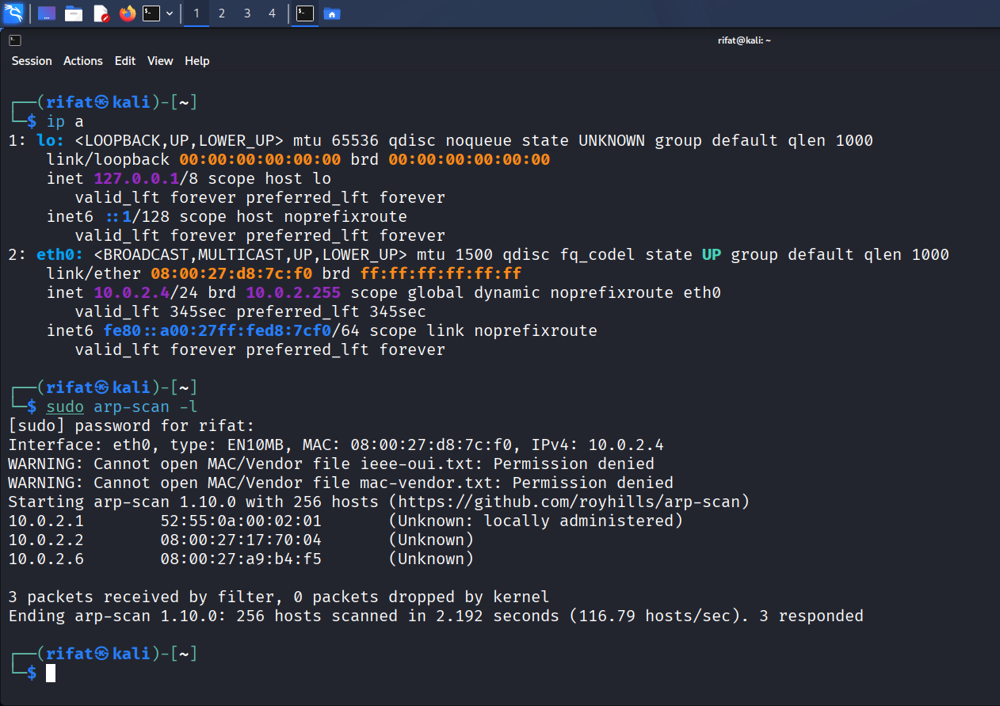
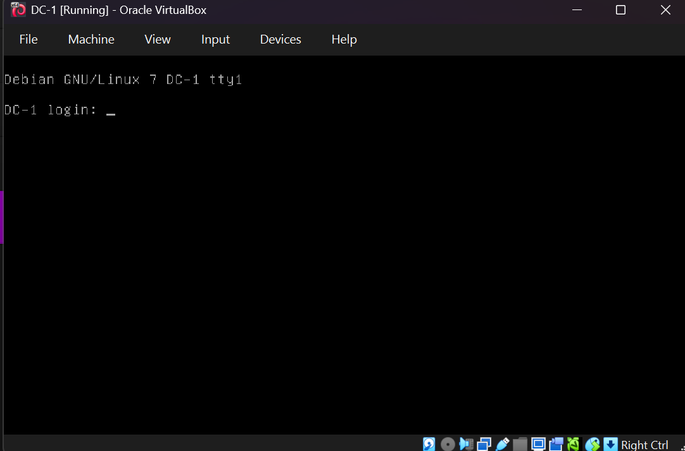
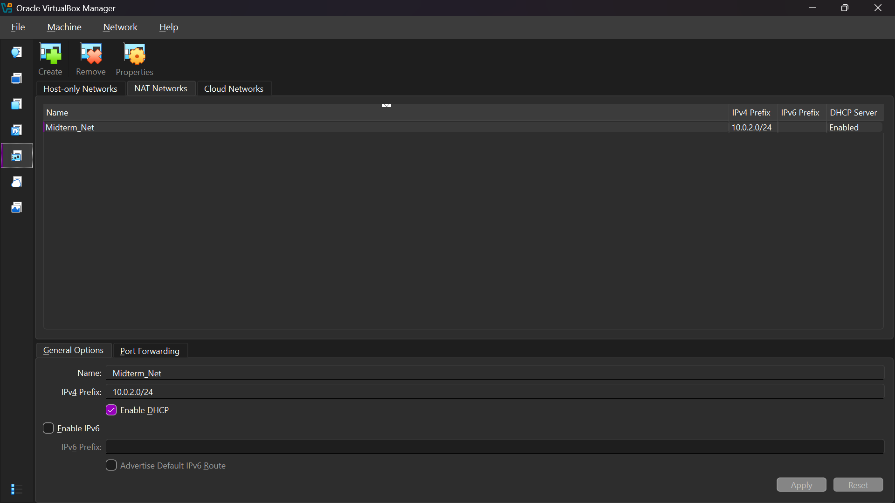
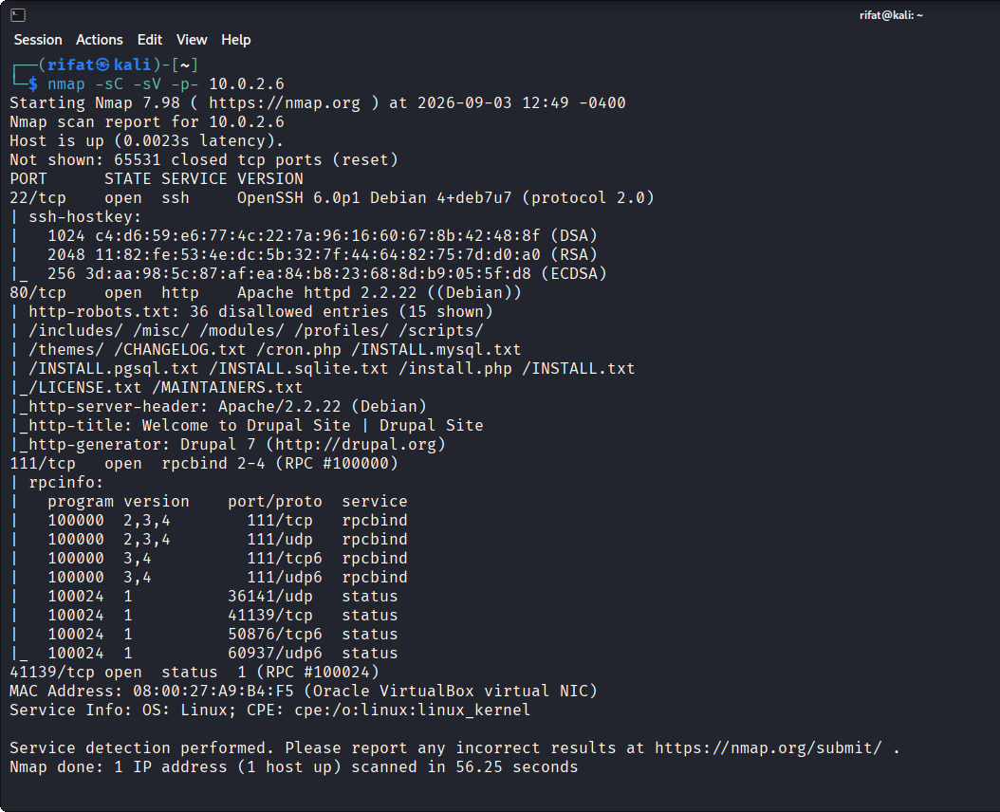
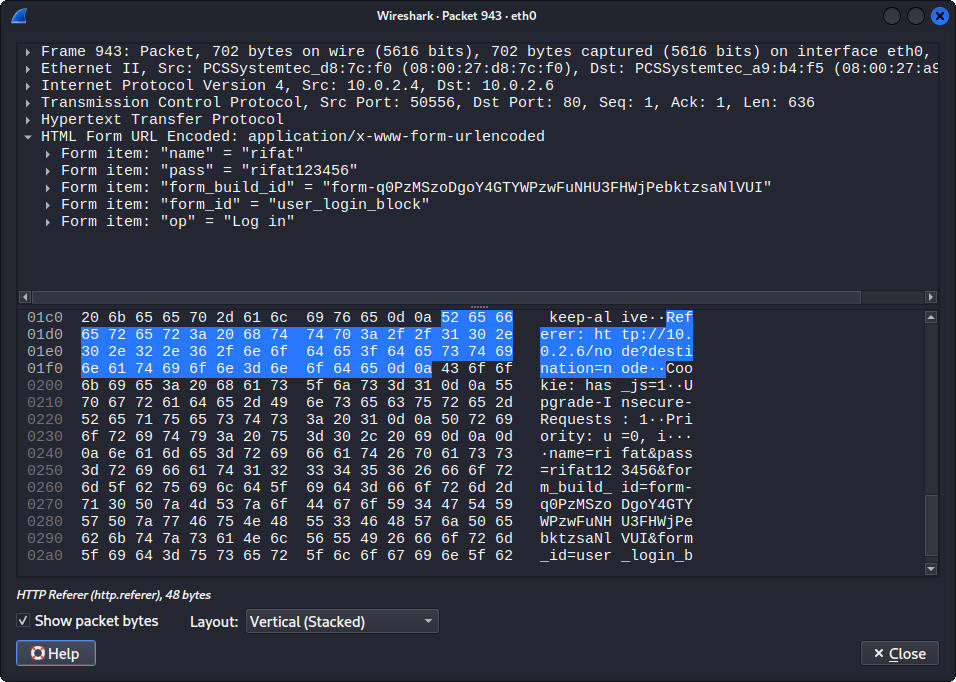
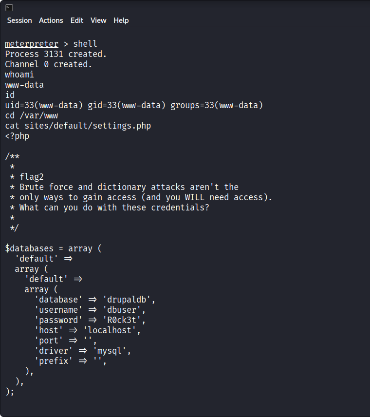
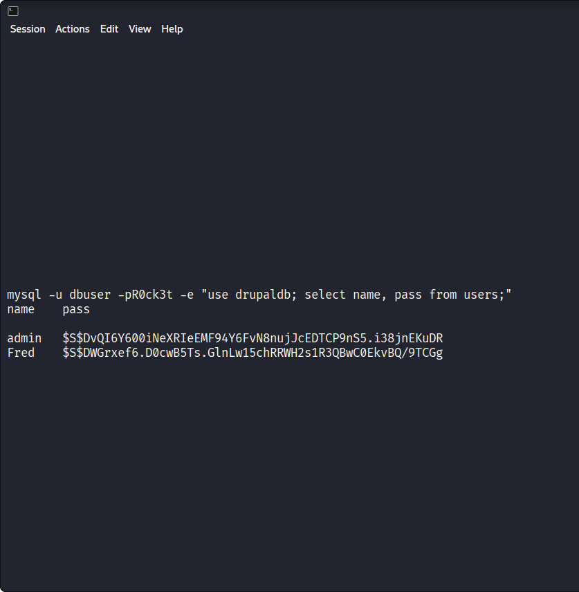
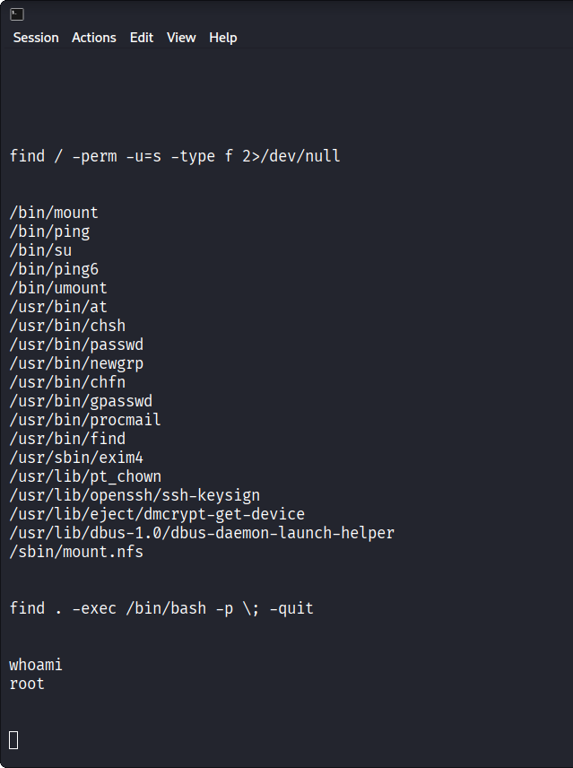

# DC-1 Security Assessment

> An end-to-end security assessment and penetration testing walkthrough of the **DC-1** vulnerable machine from VulnHub, performed inside an isolated virtual lab.



## Table of Contents

- [Lab Overview](#lab-overview)
- [Assessment Workflow](#assessment-workflow)
- [Key Findings](#key-findings)
- [Evidence](#evidence)
- [Hardening Recommendations](#hardening-recommendations)

## Lab Overview

| Component | Details                             |
| --------- | ----------------------------------- |
| Target    | DC-1, Debian GNU/Linux 7            |
| Attacker  | Kali Linux                          |
| Network   | Isolated NAT Network: `Midterm_Net` |
| Subnet    | `10.0.2.0/24`                       |
| Target IP | `10.0.2.6`                          |




## Assessment Workflow

### 1. Reconnaissance and Service Discovery

The target IP was identified with `arp-scan`, followed by full TCP port and service enumeration.

```bash
nmap -sC -sV -p- 10.0.2.6
```




### 2. Traffic Analysis

HTTP traffic was captured and reviewed in Wireshark. Because the application did not use encryption, form parameters and session headers were visible in clear text. Authentication-related HTTP POST requests exposed internal request data.



### 3. Initial Access: Drupalgeddon

The host was running an outdated Drupal 7 installation vulnerable to remote code execution. Successful exploitation provided an initial shell in the context of `www-data`.

### 4. Credential Harvesting

Drupal database credentials were found in:

```text
/var/www/sites/default/settings.php
```

The database user was `dbuser`. Drupal user password hashes were then queried from the database:

```bash
mysql -u dbuser -pR0ck3t -e "use drupaldb; select name, pass from users;"
```




### 5. Privilege Escalation

SUID enumeration exposed a misconfigured copy of `/usr/bin/find`:

```bash
find / -perm -u=s -type f 2>/dev/null
```

Because the binary retained its SUID bit, it could be abused to spawn a privileged shell:

```bash
find . -exec /bin/bash -p \; -quit
```



## Key Findings

| Port      | Service                    | Observation                                         | Impact                                            |
| --------- | -------------------------- | --------------------------------------------------- | ------------------------------------------------- |
| `22/tcp`  | OpenSSH `6.0p1`            | Remote shell service exposed                        | Increased attack surface                          |
| `80/tcp`  | Apache `2.2.22` / Drupal 7 | Deprecated web stack with known vulnerabilities     | Remote code execution and initial access          |
| `111/tcp` | `rpcbind`                  | RPC service exposed                                 | Additional service enumeration and attack surface |
| HTTP      | Unencrypted web traffic    | Form data and session headers visible in clear text | Credential and session exposure                   |
| SUID      | `/usr/bin/find`            | Unnecessary SUID permission retained                | Privilege escalation to root                      |

## Hardening Recommendations

- **Patch management:** Upgrade Drupal and Apache to supported releases, or migrate away from deprecated Drupal 7.
- **Transport encryption:** Enforce HTTPS/TLS for every web request and redirect HTTP traffic to HTTPS.
- **Credential protection:** Rotate exposed database credentials and store secrets outside web-accessible configuration paths.
- **SUID audit:** Remove the unnecessary SUID bit from `find`:

  ```bash
  chmod u-s /usr/bin/find
  ```

- **Network reduction:** Disable unused services and restrict SSH, RPC, and administrative interfaces to trusted management hosts.

## Assessment Scope

This assessment was performed only against the intentionally vulnerable DC-1 machine inside an isolated lab network. The techniques and commands documented here should be used only on systems where explicit authorization has been granted.
